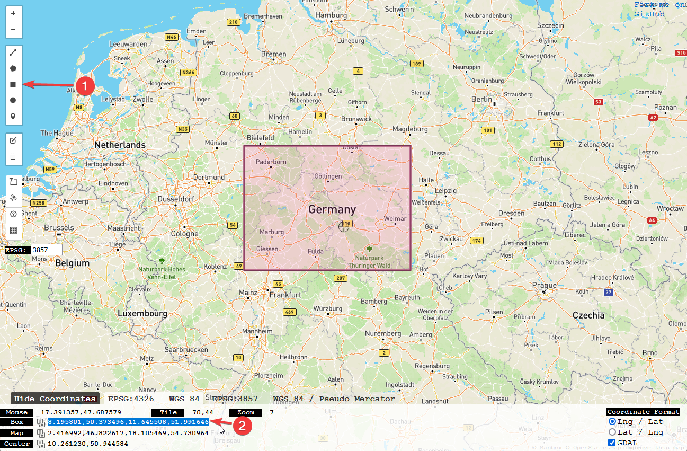

# SimELS - Simuliertes Einsatzleitsystem
BESCHREIBUNG

BILD

## Nutzung
### Zurücksetzen
Alle Änderungen werden über den Browser gespeichert. Beim löschen der Webseitendaten gehen alle Einsätze und Einstellungen verloren.
Entsprechend kann man das Systen durch das Löschen der Webseitendaten wieder in den Ausgangszustand versetzen.
### Erster Start
Beim ersten Aufruf ist die Webseite mit gewissen Standartwerten konfiguriert:
 - Karte und Suchfunktion ist auf den Raum Deutschland begrenzt
 - Es gibt keine offenen Einsätze
 - Das System ist nicht für Fahrzeugstandorte konfiguriert
 - Es ist kein Alarmgong voreingestellt

 #### Einsatzgebiet festlegen
 Es bietet sich an die Karte und Suchfunktion auf das tatsächliche Einsatzgebiet zu begrenzen. Entsprechend kann man das Sichtfeld der Karte nicht aus diesem Gebiet herausbewegen und die Suchergebnisse sind relevanter.
 
 -  Webseite [BBoxFinder](http://bboxfinder.com/) öffnen
 - **(1)** Einsatzgebiet mit dem Rechteck-Werkzeug auswählen
 - **(2)** Koordinaten der *"Box"* auswählen und kopieren
 - Im SimELS unter *"Einstellungen"* >> *"Bounding Box"* einfügen
 - *Speichern*-Knopf neben der Überschrift *"Einsatzbereich"* anklicken

 